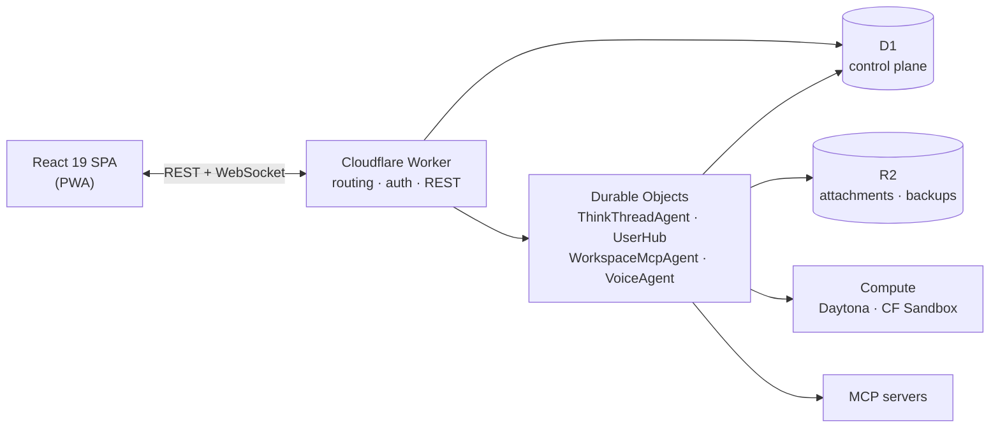

# Nadi

Mobile-first agentic chat you host yourself. Bring your own model keys; the
agent gets a real sandbox, your MCP servers, and a schedule.


## What is Nadi?

Most agent products ask you to trust someone else's cloud with your keys, your
code, and your conversations. Nadi is a single Cloudflare Worker you deploy to
your own account. Your D1 database, your R2 bucket, your provider keys, your
sandbox credentials — nothing routes through a vendor in the middle.

It is built for a phone first. Threads survive backgrounding, work continues
while the tab is closed, and the app keeps working read-only when the network
does not. An agent that only works at a desk is not much use when the thing you
need it to do arrives at 11pm.

Model providers are pluggable — Anthropic, OpenAI, OpenRouter, Workers AI,
OpenCode Zen — and the model is a per-thread snapshot, so changing your default
never rewrites the past.

## Features

- **Threads with real work.** Every chat is a Durable Object with its own
  history, token budget and automatic compaction.
- **MCP with per-tool policy.** Attach any MCP server — ticketing, docs, CRM,
  your own — and set each tool to `auto_allow`, `approval_required`, or `deny`.
  Approvals are signed, not trusted.
- **Automata.** Scheduled agent runs that post back only when they have
  something to say.
- **Sandboxed execution.** Workbenches define a repo, a machine size and an
  environment; the agent gets a shell, a filesystem and a git identity — for the
  work that needs one.
- **Skills and memory.** Reusable procedures and durable facts, both editable
  from the app and by the agent.
- **Subagents.** Parallel work on the parent's machine, feature-flagged.
- **Offline PWA.** Installable, with read-only history when disconnected.

## Architecture



- **Worker** — authenticates, serves the SPA, routes agent traffic.
- **Durable Objects** — one per thread; the SDK owns message persistence in DO
  SQLite, so there is no hand-rolled message store.
- **D1** — the control plane: workspaces, agents, MCP servers, tool policy,
  workbenches, automata, the thread index.
- **Compute** — provider-neutral (`src/compute`); Daytona and Cloudflare Sandbox
  Containers implement one backend contract.

**[`docs/architecture.md`](./docs/architecture.md) is the full tour** — request
path, the DO model, how compute is abstracted, and where state actually lives.

## Quickstart

```bash
pnpm install
cp .dev.vars.example .dev.vars   # add BETTER_AUTH_SECRET, TOOL_APPROVAL_SECRET, a model key
pnpm run db:migrate:local
pnpm run dev                     # Worker on :8787
pnpm run web:dev                 # SPA on :5173, second terminal
```

Schema lives in `src/db/schema.ts`; migrations are drizzle-generated and never
hand-edited (`pnpm run db:generate`). Full workflow:
[`docs/runbooks/local-dev.md`](./docs/runbooks/local-dev.md).

## Known issues

Live constraints, not aspirations — you will meet these:

- **MCP servers are not reachable from inside a Daytona sandbox.** Daytona's
  `domainAllowList` *replaces* its org-default egress list rather than extending
  it, and caps at 20 entries — too few to carry a working toolchain *and* a
  workspace's MCP hosts. New workspaces therefore default to Cloudflare Sandbox.
  This does not affect MCP tool calls themselves, which the Worker makes.
- **Cloudflare Sandbox cannot honour a network allowlist.** It has no
  network-policy API, so a workspace with restrictions set fails closed with
  `policy_rejected` rather than running unrestricted.
- **Egress policy applies at sandbox creation only.** Enabling an MCP server
  does not reach a sandbox that already exists; it takes a fresh one.
- **Subagents and process watchers are off by default**
  (`BACKGROUND_WORK_ENABLED`). They work, but they are still being hardened.
- **Self-hosting is not yet a documented afternoon.** Deploying takes reading
  `wrangler.jsonc` and the runbooks; the guided path is the next milestone.

## Roadmap

Milestones, not dates:

1. **Private beta hardening** — the app does not corrupt data or look broken.
2. **Open-source release** — a stranger can self-host on their own Cloudflare
   account and be productive the same afternoon.
3. **Workspaces and sharing** — multiple users, personal vs shared threads,
   public read-only conversation links.
4. **Coding depth** — subagents on by default, sturdier watchers, richer
   workbenches.

A hosted service is deferred until the compute economics are understood. The
self-hosted path is the product.

## Contributing

Issues and pull requests are welcome — see
[`CONTRIBUTING.md`](./CONTRIBUTING.md) for the dev loop, the test layout, and the
traps worth knowing before your first PR. Report vulnerabilities privately via
[`SECURITY.md`](./SECURITY.md), never a public issue.

## Going deeper

- [`docs/architecture.md`](./docs/architecture.md) — the system in full
- [`AGENTS.md`](./AGENTS.md) — working conventions, design system, the rules that bite
- [`docs/runbooks/`](./docs/runbooks) — local dev and day-to-day operations
- [`docs/operations/`](./docs/operations) — Cloudflare Sandbox provisioning and smoke checks
- [`docs/github-app-setup.md`](./docs/github-app-setup.md) — GitHub App for sandbox git access
- [`.dev.vars.example`](./.dev.vars.example) — every knob, documented in place

## License

[Apache 2.0](./LICENSE).
