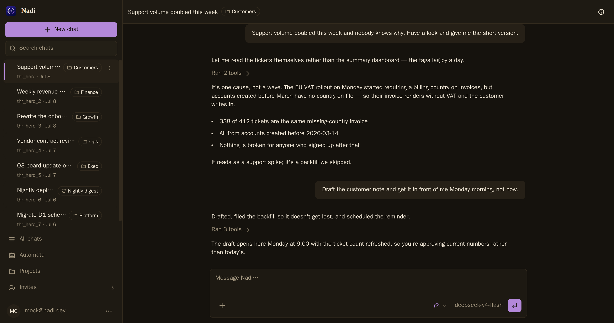
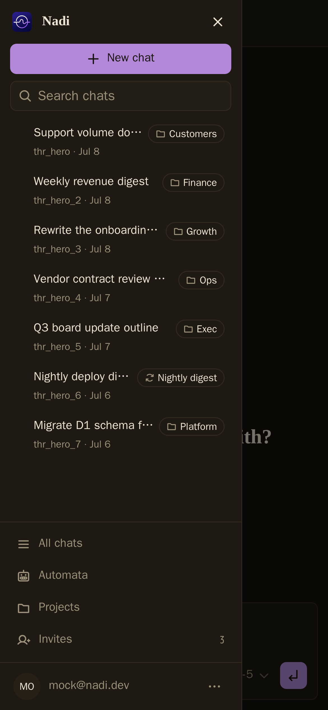
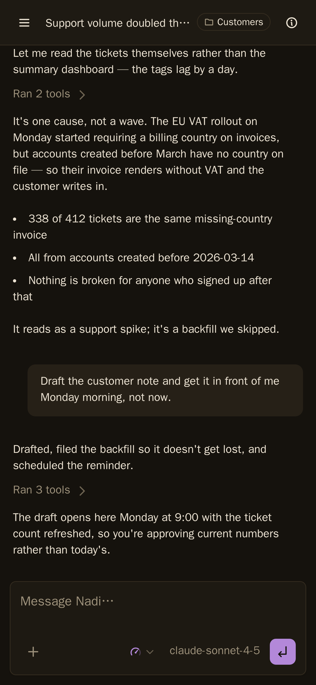
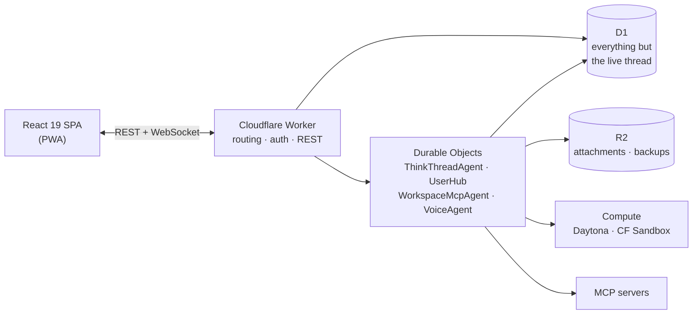

# Nadi

An open-source, ChatGPT-like app that runs on your own Cloudflare account, on
any model with your own key. The agent gets a real machine to work on, your MCP
servers, memory and skills it writes for itself, and schedules that run while
you're away.



Built for a phone first. Install it and it can reach you when a job finishes:
threads survive backgrounding, work carries on while the tab is closed, and
history stays readable offline.

<p align="center">
  
  
</p>

Nine providers or any endpoint you can name, changeable mid-thread.

## Getting started

**Try it** — [nadiai.app](https://nadiai.app) runs the hosted beta. It is
invite-only for now; without an invite you can still leave your email and we
will write when there is room.

**Run it yourself** — everything below works against your own Cloudflare
account.

```bash
pnpm install
cp .dev.vars.example .dev.vars   # add BETTER_AUTH_SECRET, TOOL_APPROVAL_SECRET, a model key
pnpm run db:migrate:local
pnpm run dev                     # Worker on :8787
pnpm run web:dev                 # SPA on :5173, second terminal
```

Schema lives in `src/db/schema.ts`; migrations are drizzle-generated and never
hand-edited (`pnpm run db:generate`). Full workflow:
[`docs/runbooks/local-dev.md`](./docs/runbooks/local-dev.md).

## Features

- **Threads with real work.** Every chat is a Durable Object with its own
  history, token budget and automatic compaction.
- **MCP with per-tool policy.** Attach any MCP server — [Composio](https://composio.dev/)
  for a thousand-odd SaaS integrations, [Markdump](https://markdump.com) for
  markdown notes the agent reads and writes like a second brain, or your own —
  and set each tool to `auto_allow`, `approval_required`, or `deny`. Approvals
  are signed, not trusted.
- **Automata.** Scheduled agent runs that report into a thread — every run, or
  only the ones that fail.
- **Sandboxed execution.** Workbenches define a repo, a machine size and an
  environment; the agent gets a shell, a filesystem and a git identity — for the
  work that needs one.
- **Skills and memory.** Reusable procedures and durable facts, both editable
  from the app and by the agent.
- **Subagents.** Parallel work on the parent's machine (Currently, feature-flagged off).
- **Installable PWA.** Push notifications when unattended work finishes (needs
  VAPID keys), and read-only history when disconnected.

## Architecture



- **Worker** — authenticates, serves the SPA, routes agent traffic.
- **Durable Objects** — one per thread; the SDK owns message persistence in DO
  SQLite, so there is no hand-rolled message store.
- **D1** — everything but the live conversation: workspaces, agents, MCP servers
  and tool policy, workbenches, automata, invites, plus the thread index, the
  message search index and archived threads.
- **Compute** — provider-neutral (`src/compute`); Daytona and Cloudflare Sandbox
  Containers implement one backend contract.

**[`docs/architecture.md`](./docs/architecture.md) is the full tour** — request
path, the DO model, how compute is abstracted, and where state actually lives.

## Known issues

Live constraints, not aspirations — you will meet these:

- **MCP servers are not reachable from inside a Daytona sandbox.** Daytona's
  `domainAllowList` _replaces_ its org-default egress list rather than extending
  it, and caps at 20 entries — too few to carry a working toolchain _and_ a
  workspace's MCP hosts. New workspaces therefore default to Cloudflare Sandbox.
  This does not affect MCP tool calls themselves, which the Worker makes.
- **Cloudflare Sandbox cannot honour a network allowlist.** It has no
  network-policy API, so a workspace with restrictions set fails closed with
  `policy_rejected` rather than running unrestricted.
- **Egress policy applies at sandbox creation only.** Enabling an MCP server
  does not reach a sandbox that already exists; it takes a fresh one.
- **Subagents and process watchers are off by default**
  (`BACKGROUND_WORK_ENABLED`). They work, but they are still being hardened.
- **Self-hosting off Cloudflare is new.** Nadi runs on
  [celld](https://github.com/denoland/celld) with your own S3 bucket — see
  [`docs/self-hosting-celld.md`](./docs/self-hosting-celld.md). Voice, Workers
  AI, browser rendering, web push and GitHub App auth need Cloudflare bindings
  celld has no equivalent for, and are unavailable there; the guide says so
  plainly and explains what a crash costs.

## Roadmap

Milestones, not dates:

1. **Private beta hardening** — the app does not corrupt data or look broken.
2. **Open-source release** — a stranger can self-host on their own Cloudflare
   account and be productive the same afternoon.
3. **Workspaces and sharing** — multiple users, personal vs shared threads,
   public read-only conversation links.
4. **Coding depth** — subagents on by default, sturdier watchers, richer
   workbenches.

The hosted beta is how this gets tested, not a product yet; a paid service
waits until the compute economics are understood.

## Contributing

Issues and pull requests are welcome — see
[`CONTRIBUTING.md`](./CONTRIBUTING.md) for the dev loop, the test layout, and the
traps worth knowing before your first PR. Report vulnerabilities privately via
[`SECURITY.md`](./SECURITY.md), never a public issue.

## Going deeper

- [`docs/architecture.md`](./docs/architecture.md) — the system in full
- [`AGENTS.md`](./AGENTS.md) — working conventions, design system, the rules that bite
- [`docs/runbooks/`](./docs/runbooks) — local dev and day-to-day operations
- [`docs/operations/`](./docs/operations) — Cloudflare Sandbox provisioning and smoke checks
- [`docs/self-hosting-celld.md`](./docs/self-hosting-celld.md) — running Nadi off Cloudflare, on your own machine
- [`docs/github-app-setup.md`](./docs/github-app-setup.md) — GitHub App for sandbox git access
- [`.dev.vars.example`](./.dev.vars.example) — every knob, documented in place

## License

[Apache 2.0](./LICENSE).
